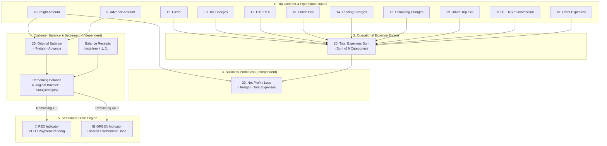
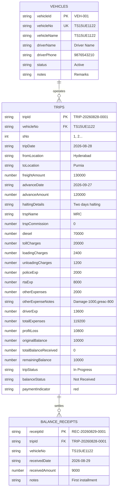

# 🚚 SR_T LORRY FREIGHT MANAGEMENT SYSTEM

## COMPLETE SYSTEM SPECIFICATION & ARCHITECTURE BLUEPRINT — VERSION 2.4.2

**Target Workspace:** `D:\Repo\Lorry`  
**Document Version:** v2.4.2 (Authoritative Production Master Specification)  
**Updated Date:** 2026-09-28  
**Reference Deployments:** Cloudflare Pages / Vercel Edge / Google Apps Script Web App  
**Core Technologies:** HTML5, Modern CSS (Tailwind CDN + Modular Stylesheets), Modular JavaScript (ES Modules), Google Apps Script, Google Sheets, ExcelJS  
**Data Integrity Policy:** Zero Data Loss • Strict Multi-Vehicle Isolation • No Automatic `git push`

---

# 1. EXECUTIVE SUMMARY & SYSTEM OVERVIEW

The **SR_T Lorry Freight Management System** is an enterprise-grade transport operations and financial settlement platform designed specifically for long-haul lorry fleet management.

The system manages vehicle fleets as **strictly isolated operational workspaces**, beginning with initial vehicles:
1. **`TS15UE1122`**
2. **`TG15T6666`**

### Core Principles
1. **Single Cloud-First Master Database:** One Google Spreadsheet (`Trips`, `Vehicles`, `BalanceReceipts`) serves as the cloud source of truth, backed by Google Drive snapshots.
2. **Strict Multi-Vehicle Isolation:** Trips, expenses, profits, balances, and customer payments belonging to `TS15UE1122` never contaminate or participate in `TG15T6666` metrics, and vice versa.
3. **Decoupled Financial Mathematics:** Operational Profit/Loss ($\text{Freight} - \text{Expenses}$) is completely separated from Customer Receivables ($\text{Freight} - \text{Advance} - \text{Installments}$).
4. **Interactive POD Settlement Engine:** Dynamic installment receipts track outstanding freight balances down to exact $₹0$, automatically transitioning payment indicators from **`🔴 RED (Payment Pending)`** to **`🟢 GREEN (Cleared / Done)`**.
5. **Clear Separation of Concerns:**
   - **`👁️ View`:** Dedicated Read-Only inspection modal (zero form fields, complete itemized breakdown).
   - **`✏️ Edit`:** Interactive Settlement Drawer for expense adjustments and balance installment entries.
6. **Operational Date Scope & Audit Filters:** Quick time-slice filters (Today, Single Date, Date Range, Month View, All Trips) combined with 8 real-time Status & Audit Cards with dynamic counters.

---

# 2. MASTER APPLICATION FLOW & WORKSPACE ARCHITECTURE

```text
                             ┌──────────────────────────────┐
                             │       1. LOGIN OVERLAY       │
                             │ (Admin: Shravan / Emp: Rudra)│
                             └──────────────┬───────────────┘
                                            │ Authenticated Session
                                            ▼
                             ┌──────────────────────────────┐
                             │ 2. DYNAMIC VEHICLE SELECTION │
                             │  (Loaded from Vehicles Sheet)│
                             │  ┌────────────┐┌───────────┐ │
                             │  │ TS15UE1122 ││ TG15T6666 │ │
                             │  └────────────┘└───────────┘ │
                             └──────────────┬───────────────┘
                                            │ Select Vehicle Workspace
                                            ▼
                             ┌──────────────────────────────┐
                             │  3. ACTIVE VEHICLE WORKSPACE │
                             │   currentVehicle: TS15UE1122 │
                             └──────────────┬───────────────┘
                                            │
         ┌──────────────────────────────────┴──────────────────────────────────┐
         ▼                                  ▼                                  ▼
 ┌──────────────────┐              ┌──────────────────┐               ┌──────────────────┐
 │   ☰ MENU PANEL   │              │VEHICLE DASHBOARD │               │VEHICLE LEDGER/TAB│
 │ 🏠 Dashboard     │              │ Trips | Freight  │               │ 📅 Date Scopes   │
 │ 📋 Transactions  │              │ Expenses| Profit │               │ 🔍 8 Status Cards│
 │ 📊 View Excel    │              │ Pending Receiv.  │               │ 25-Column Table  │
 │ 🚚 Vehicle Data  │              │ (Strictly 1122)  │               │ 👁️ View Modal    │
 │ ⚙ Settings      │              └──────────────────┘               │ ✏️ Edit Drawer   │
 │ 🔄 Switch Vehicle│                                                 └──────────────────┘
 │ 🚪 Logout        │
 └──────────────────┘
```

---

# 3. CANONICAL FINANCIAL FORMULAS & CALCULATION ENGINE

The system strictly adheres to the business accounting model established from operational freight logs:



### 3.1 The 9 Operational Expenses
The Total Operational Expense is the exact mathematical sum of 9 distinct expense categories:
$$\text{Total Expenses} = \text{Diesel} + \text{Toll} + \text{RTA} + \text{Police} + \text{Loading} + \text{Unloading} + \text{Driver Exp} + \text{TRSP Comm} + \text{Other Exp}$$

### 3.2 Internal Margin: Trip Profit / Loss
Trip profit represents internal company performance and is completely decoupled from customer collections:
$$\text{Profit / Loss} = \text{Freight Amount} - \text{Total Expenses}$$

### 3.3 External Receivable: Customer Balance & Installments
The amount owed by the broker/customer is governed strictly by the contract freight, initial advance, and recorded installment payments:
$$\text{Original Balance} = \text{Freight Amount} - \text{Advance Amount}$$
$$\text{Remaining Balance} = \text{Original Balance} - \sum \text{Balance Receipts}$$

### 3.4 Verification Example (From Operational Sheet `media_1790587340631.png`)
| Item | Field / Column | Amount | Calculation |
| :--- | :--- | :---: | :--- |
| **Contract Freight** | `6. Freight Amount` | **₹1,30,000** | Initial freight contract |
| **Initial Advance** | `8. Advance Amount` | **₹1,20,000** | Paid on dispatch (`27-09-2026`) |
| **Diesel** | `12. Diesel` | ₹70,000 | Fuel slip |
| **Toll Charges** | `13. Toll Charges` | ₹20,000 | FASTag / Cash |
| **EXP RTA** | `17. EXP RTA` | ₹8,000 | Border / RTA check |
| **Police Exp** | `16. Police Exp` | ₹2,000 | En-route checks |
| **Loading Charges** | `14. Loading Charges` | ₹2,400 | Origin labor |
| **Unloading Charges** | `15. Unloading Charges` | ₹1,200 | Destination labor |
| **Driver Exp** | `19. Driver Exp` | ₹13,600 | Driver trip commission |
| **TRSP Commission** | `20. TRSP Commission` | ₹0 | Broker commission |
| **Other Expenses** | `18. Other Expenses` | ₹2,000 | Notes: *Damage-1000, greac-800* |
| **Total Expenses** | `20. Sum OF Total Exp` | **₹1,19,200** | $\sum(70\text{k}+20\text{k}+8\text{k}+2\text{k}+2.4\text{k}+1.2\text{k}+13.6\text{k}+0+2\text{k})$ |
| **Profit Trip Amount** | `23. P/L` | **+₹10,800** | $₹1,30,000 - ₹1,19,200 = \mathbf{+₹10,800\text{ (Profit)}}$ |
| **Original Balance** | `25. Original Balance` | **₹10,000** | $₹1,30,000 - ₹1,20,000 = \mathbf{₹10,000}$ |

### 3.5 Step-by-Step Customer Balance Lifecycle

| Lifecycle Stage | Action / Event | Total Recv | Remaining Balance | Balance Status | Visual Indicator |
| :--- | :--- | :---: | :---: | :---: | :---: |
| **Initial (At Dispatch)** | Freight ₹1,30,000 − Advance ₹1,20,000 | **₹0** | **₹10,000** | `Not Received` | **🔴 RED (Pending)** |
| **Stage 1 Installment** | Receipt 1: +₹9,000 recorded | **₹9,000** | **₹1,000** | `Partially Received` | **🔴 RED (Pending)** |
| **Stage 2 Settlement** | Receipt 2: +₹1,000 recorded | **₹10,000** | **₹0** | `Done` | **🟢 GREEN (Cleared)** |
| **Illegal Overpayment** | Receipt Attempt: +₹10,800 or +₹2,000 | — | — | **STRICTLY REJECTED** | — |

> [!CAUTION]
> **CRITICAL ARCHITECTURAL DISTINCTION: ₹10,800 vs ₹10,000**
> * **₹10,800 is Internal Trip Profit/Loss** ($\text{Freight } ₹1,30,000 - \text{Total Expenses } ₹1,19,200$).
> * **₹10,000 is External Customer Receivable** ($\text{Freight } ₹1,30,000 - \text{Advance } ₹1,20,000$).
> * These two financial metrics represent completely different concepts and **MUST NEVER BE MIXED**.
> * An attempt to enter a ₹10,800 receipt against the ₹10,000 customer balance will be **immediately rejected** with `Overpayment rejected`.
> * $\text{Remaining Balance}$ is **NEVER** $\text{Freight} - \text{Expenses}$, and **NEVER** $\text{Profit/Loss}$.

---

# 4. TIME SCOPE DATE FILTERS & 8 STATUS/AUDIT CARDS

Above the master data ledger, the application provides two persistent control sections:

### 4.1 Time Scope Date Selectors
1. **📌 TODAY:** Filters trips scheduled/dispatched today (`YYYY-MM-DD`).
2. **🗓️ SELECTED DATE:** Interactive `<input type="date">` with `VIEW` button to inspect any single day's dispatch.
3. **↔️ DATE RANGE:** Two interactive `<input type="date">` fields (`From` and `To`) with a `VIEW RANGE` button.
4. **📆 ENTIRE MONTH:** Operational month dropdown selector (e.g. August 2026, September 2026) with a `VIEW MONTH` button.
5. **📋 ALL TRIPS:** Full operational history for the active vehicle.

### 4.2 The 8 Vibrant Status & Audit Cards
Each card displays an icon, real-time count badge, title, and descriptive subtitle:
1. **📋 ALL TRIPS (`#filter-btn-all`):** Total operations in current timeframe scope.
2. **🆕 NEW DISPATCH (`#filter-btn-new`):** Freshly dispatched trips (`status === 'New'`).
3. **🟢 PROFIT TRIPS (`#filter-btn-profit`):** Trips with $\text{Net P/L} \ge ₹0$.
4. **🔴 LOSS TRIPS (`#filter-btn-loss`):** Trips with $\text{Net P/L} < ₹0$.
5. **🟠 PENDING BALANCE (`#filter-btn-pending`):** Trips with uncollected customer balance ($\text{Received} = 0$).
6. **🟡 PARTIALLY PAID (`#filter-btn-partial`):** Trips with partial balance installments ($\text{Received} > 0 \land \text{Remaining} > 0$).
7. **✔️ PAID & SETTLED (`#filter-btn-paid`):** Trips fully settled ($\text{Remaining} = ₹0$).
8. **⚠️ BALANCE MISMATCH (`#filter-btn-mismatch`):** Immediate financial audit alert identifying any record where $\text{Original Balance} \ne \text{Freight} - \text{Advance}$.

---

# 5. USER EXPERIENCE: VIEW MODAL vs. EDIT DRAWER

To eliminate view confusion and prevent accidental edits:

### 5.1 👁️ Dedicated Read-Only View Modal (`#modal-view-trip`)
* **Trigger:** Click `👁️ View` on any trip row in the table.
* **Layout:**
  - **Executive Hero Banner:** Vehicle No, Trip #, Origin ➔ Destination, Dispatch Date, Payment Status Badge, Trip Status Badge.
  - **6 Financial Metric Cards:** Freight Amount, Advance Amount, Total Expenses (9 sum), Total Exp Given, Net Profit/Loss (with margin %), Remaining Balance.
  - **Logistics & Broker Section:** Halting Details, TRSP Name, TRSP Commission.
  - **9 Itemized Expenses Breakdown:** Discrete cards for Diesel, Toll, Loading, Unloading, Police, RTA, Driver Commission, TRSP Commission, and Other Expenses with notes.
  - **Customer Balance Receipts History Table:** Chronological installments with Received Date, Received Amount, Running Remaining Balance, and Notes.
  - **Action Footer:** `✏️ Edit This Trip` (switches to edit mode) and `✕ Close`.
* **Zero Input Elements:** Pure data visualization with no text boxes or dropdowns.

### 5.2 ✏️ Trip Management & Settlement Drawer (`#drawer-panel`)
* **Trigger:** Click `✏️ Edit` on table row or `✏️ Edit This Trip` inside View Modal.
* **Capabilities:**
  - Edit all trip parameters (Trip Date, Route, Halting Details, TRSP Name).
  - Modify Freight Amount, Advance Amount, Advance Date.
  - Adjust any of the 9 operational expense categories.
  - **+ Record Balance Payment Installment:** Form to input installment Date, Amount (₹), and Notes (UPI/Cheque).
  - **Interactive Receipts History Table:** Allows deleting individual installment receipts with live re-computation.
  - **Live Settlement Strip:** Shows real-time `Original Balance`, `Total Received`, and `Remaining Balance` with 🔴/🟢 badge.

---

# 6. DATABASE SCHEMA (3 GOOGLE SHEETS)



### Master Spreadsheet: `1X-whiMGT3BxgdMjayuXHw-d8fZeaX1dKjLeEEiIPQf0`
1. **Sheet 1: `Vehicles`:** Vehicle registry and profile metadata.
2. **Sheet 2: `Trips`:** Master operational trips ledger indexed with `vehicleNo`.
3. **Sheet 3: `BalanceReceipts`:** Sub-ledger tracking installment receipts for remaining customer balance.

---

# 7. BACKEND SECURITY: MANDATORY WRITE-VERIFICATION CHAIN

To ensure zero cross-vehicle contamination, the Google Apps Script backend (`google-apps-script/Code.gs`) enforces this assertion before executing any database mutation:

```javascript
// Step 1: Validate entity exists
const targetTrip = getTripById(tripId);
if (!targetTrip) throw new Error("Trip not found.");

// Step 2: Enforce vehicle ownership match
if (targetTrip.vehicleNo !== requestedVehicleNo) {
  throw new Error(`Vehicle Access Mismatch: Trip belongs to ${targetTrip.vehicleNo}, but operation requested for ${requestedVehicleNo}`);
}

// Step 3: Atomic Lock & Mutation Execution
LockService.getScriptLock().waitLock(10000);
try {
  // Execute write/update/delete
} finally {
  LockService.getScriptLock().releaseLock();
}
```

This verification chain is executed on every backend mutation:
- `createTrip`
- `updateTrip`
- `deleteTrip`
- `addReceipt`
- `deleteReceipt`
- `updateVehicleData`

---

# 8. MODULAR PROJECT STRUCTURE (34 PRODUCTION FILES)

```text
D:\Repo\Lorry
│
├── .gitignore
├── Final Project Upgrade.md               # Master v2.4.2 System Specification
├── index.html                             # Modular application shell
├── Lorry_Trips_ALL_TRIPS_ALL (2).xlsx     # Pristine master Excel backup
├── README.md                              # Repository overview
│
├── css/
│   ├── base.css                           # Color palette, reset, typography
│   └── components.css                     # Semantic badges, cards, sticky column shadows
│
├── docs/
│   ├── DEPLOYMENT_GUIDE.md                # Cloudflare Pages / Vercel deployment instructions
│   ├── GOOGLE_FORM_SETUP.md               # Google Form field bindings
│   └── GOOGLE_SHEET_SETUP.md              # 3-Sheet setup & column structure
│
├── google-apps-script/
│   └── Code.gs                            # 3-Sheet backend with strict vehicle isolation & LockService
│
├── js/
│   ├── api.js                             # Cloud API client with retry & mutation guards
│   ├── app.js                             # Bootstrap, authentication bindings, poller
│   ├── auth.js                            # Role-based access control (Admin / Employee)
│   ├── config.js                          # Endpoint URLs, poll timing, constants
│   ├── router.js                          # SPA view navigator & header state
│   ├── state.js                           # Central application state
│   ├── utils.js                           # Formatting, UUID generators, toast notifications
│   │
│   ├── calculations/
│   │   └── financial.js                   # 9-expense engine, profit/loss & balance state machine
│   ├── dashboard/
│   │   └── dashboard.js                   # Vehicle-scoped KPI cards & metrics
│   ├── excel/
│   │   └── excel-view.js                  # ExcelJS styled .xlsx exporter & tabular view
│   ├── receipts/
│   │   ├── receipt-form.js                # Installment validation & overpayment protection
│   │   ├── receipt-table.js               # History table renderer
│   │   └── receipts.js                    # Add/delete receipt controller
│   ├── settings/
│   │   └── settings.js                    # Global currency, date, theme settings
│   ├── trips/
│   │   ├── trip-form.js                   # Add Trip modal & Edit Drawer controller
│   │   ├── trip-table.js                  # Scoped table renderer, date filters & 8 status cards
│   │   ├── trip-validation.js             # Form validation & constraints
│   │   └── trips.js                       # Main trips CRUD & Read-Only View modal
│   └── vehicles/
│       ├── vehicle-data.js                # Profile metadata editor
│       ├── vehicle-list.js                # Dynamic vehicle selection grid
│       └── vehicle-workspace.js           # Vehicle switcher & isolation filter
│
└── tests/
    ├── financial-tests.js                 # 8 Financial unit tests (100% Passed)
    └── vehicle-isolation-tests.js         # 5 Vehicle isolation & security tests (100% Passed)
```

---

# 9. COMPREHENSIVE VERIFICATION & TEST MATRIX

All 13 automated unit tests run locally using Node.js and verify all functional constraints:

| Suite | Test ID | Description | Assertion / Constraint | Result |
| :---: | :---: | :--- | :--- | :---: |
| **Financial** | **FIN-01** | Total Expenses Auto-Sum | $70\text{k}+20\text{k}+8\text{k}+2\text{k}+2.4\text{k}+1.2\text{k}+13.6\text{k}+0+2\text{k} = \mathbf{₹1,19,200}$ | ✅ 100% Passed |
| **Financial** | **FIN-02** | Profit / Loss Calculation | $₹1,30,000 - ₹1,19,200 = \mathbf{+₹10,800\text{ Profit}}$ | ✅ 100% Passed |
| **Financial** | **FIN-03** | Original Balance Calculation | $₹1,30,000 - ₹1,20,000 = \mathbf{₹10,000}$ | ✅ 100% Passed |
| **Financial** | **FIN-04** | Balance Status Initial | Remaining: ₹10,000 ➔ Status: `Not Received`, Indicator: `🔴 RED` | ✅ 100% Passed |
| **Financial** | **FIN-05** | Installment 1 (₹9,000) | Remaining: ₹1,000 ➔ Status: `Partially Received`, Indicator: `🔴 RED` | ✅ 100% Passed |
| **Financial** | **FIN-06** | Installment 2 (₹1,000) | Remaining: ₹0 ➔ Status: `Done`, Indicator: `🟢 GREEN` | ✅ 100% Passed |
| **Financial** | **FIN-07** | Overpayment Rejection | Receipt of ₹12,000 against ₹10,000 balance strictly rejected | ✅ 100% Passed |
| **Financial** | **FIN-08** | Negative Expense Guard | Negative values in any of 9 expenses rejected | ✅ 100% Passed |
| **Isolation** | **VEH-01** | TS15UE1122 Workspace Scope | `getActiveTrips()` returns only trips where `vehicleNo === 'TS15UE1122'` | ✅ 100% Passed |
| **Isolation** | **VEH-02** | TG15T6666 Workspace Scope | `getActiveTrips()` returns only trips where `vehicleNo === 'TG15T6666'` | ✅ 100% Passed |
| **Isolation** | **VEH-03** | Cross-Vehicle Mutation Rejection | Mutation targeting 1122 trip from 6666 workspace rejected | ✅ 100% Passed |
| **Isolation** | **VEH-04** | Isolated Receipt Settlement | Receipts applied to 1122 reduce balance only for 1122 | ✅ 100% Passed |
| **Isolation** | **VEH-05** | Sibling Vehicle Independence | 6666 balance remains 100% unaffected by 1122 payments | ✅ 100% Passed |

---

# 10. OPERATIONAL RULES & CONSTRAINTS

1. **Local Development First:** Strictly **NO automatic `git push`**. All work remains local on the `main` branch.
2. **Master Excel Protection:** [`Lorry_Trips_ALL_TRIPS_ALL (2).xlsx`](file:///d:/Repo/Lorry/Lorry_Trips_ALL_TRIPS_ALL%20(2).xlsx) is the pristine offline backup and must never be deleted or overwritten.
3. **Google Sheets as Source of Truth:** Browser local storage is an ephemeral cache for rapid rendering and offline resilience; Google Sheets is the sole authoritative financial source of truth.
4. **Non-Destructive Polling:** Background sync respects the mutation mutex lock (`isSaving`, `pendingMutationCount > 0`) to prevent local edits from being overwritten by poller cycles.
